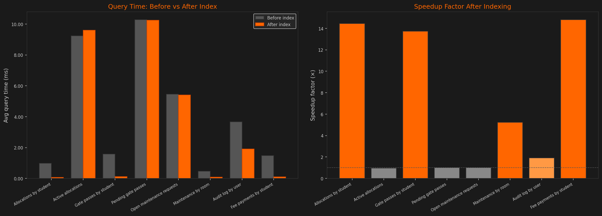

# Module B: Local API Development, RBAC, and Database Optimisation
## CS432 - Databases | Assignment 2 | Track 1
### Project: CheckInOut - Hostel Management System

---

## 1. Introduction

Module B builds a working web application on top of the schema designed in Assignment 1. The app handles CRUD operations across all hostel management tables, enforces role-based access control, logs every data modification, and applies SQL indexes to speed up the most common queries.

**Tech Stack:**
- **Frontend/Backend**: Next.js 16 (App Router), TypeScript
- **Database**: SQLite via `better-sqlite3`
- **ORM**: Drizzle ORM
- **Auth**: JWT (`jose`) + bcrypt password hashing (`bcryptjs`)

**GitHub Repository:** https://github.com/rayvego/databases-assignment-2

**Video Demonstration:** https://drive.google.com/file/d/1Mo69jJC8DiNkGKKp2_o3yPlRL973I_qO/view?usp=drive_link

---

## 2. Schema Design

The database has **13 tables** split into two categories.

### System Tables

| Table | Purpose |
|---|---|
| `users` | Authentication credentials (`username`, `password_hash`, `role`, FK to `member`) |
| `audit_log` | Immutable record of every INSERT/UPDATE/DELETE, capturing the actor, target table, record ID, and timestamp |

### Project Tables

| Table | Key Columns |
|---|---|
| `member` | Base entity for all persons (name, email, contact, age, gender, userType) |
| `student` | Extends `member` (enrollment number, course, batch year, guardian details) |
| `staff` | Extends `member` (designation, shift times) |
| `hostel_block` | Physical hostel block (name, type, warden FK to `staff`) |
| `room` | Room within a block (capacity, occupancy, type, status) |
| `allocation` | Student to room assignment with check-in/out dates and status |
| `gate_pass` | Student exit requests with approval workflow |
| `visitor` | External visitor records |
| `visit_log` | Visitor and student check-in/out log |
| `maintenance_request` | Room issue reports with priority and resolution tracking |
| `fee_payment` | Student fee transaction records |

**Key design decisions:**
- `student` and `staff` share a primary key with `member` (FK = PK pattern), so name, email, and contact are stored once and not duplicated across tables.
- `users` is a separate authentication table. Credentials are never mixed into `member`, keeping auth data cleanly separate from application data.
- All enumerated types are stored as `TEXT` with application-level validation, since SQLite has no native ENUM support.

---

## 3. Security & RBAC

### 3.1 Authentication Flow

```
POST /api/auth/login  { username, password }
  → 200 { token, role, username }    JWT, 7-day expiry, HS256
  → 401                              invalid credentials

Every subsequent request:
  Authorization: Bearer <token>
  → 401   missing or expired token
  → 403   valid token, insufficient role
```

The JWT payload carries `{ userId, username, role }`. No session state is stored server-side. The token is verified on every request and all auth context comes from it.

### 3.2 RBAC Roles

| Role | Permissions |
|---|---|
| `admin` | Full CRUD across all tables. Can approve/reject gate passes, resolve maintenance requests, manage allocations and fee records. |
| `user` | Read access across all tables. Can submit gate pass requests and maintenance reports, but cannot approve, delete, or touch other users' records. |

Role checks are in `lib/middleware.ts` via two guard functions called at the top of every route handler:

```ts
// any authenticated user
const session = await requireAuth(request)
if (isNextResponse(session)) return session

// admin only
const session = await requireAdmin(request)
if (isNextResponse(session)) return session
```

### 3.3 Audit Logging

Every INSERT, UPDATE, and DELETE calls `logAction()` from `lib/audit.ts`, which writes to both the `audit_log` table and `logs/audit.log`:

```ts
logAction({
  tableName: 'allocation',
  action: 'INSERT',
  recordId: newAllocation.allocationId,
  performedBy: session.userId,
  details: { studentId, roomId }
})
```

**Detecting unauthorised direct database modifications:** Any change made directly to `sqlite.db`, bypassing the API, will have no entry in `audit_log`. These gaps are easy to spot by checking for record IDs with no corresponding log entry. Direct modifications also have no `performed_by` value, so they stand out from normal API operations.

---

## 4. SQL Indexing Strategy

### 4.1 Queries Identified for Optimisation

| Query Pattern | Endpoint | Rationale |
|---|---|---|
| `WHERE student_id = ?` on `allocation` | GET allocations | Student room history lookup |
| `WHERE status = 'Active'` on `allocation` | GET allocations | Dashboard active allocation count |
| `WHERE student_id = ?` on `gate_pass` | GET gate passes | Student pass history |
| `WHERE status = 'Pending'` on `gate_pass` | GET gate passes | Admin approval queue |
| `WHERE status = 'Open'` on `maintenance_request` | GET maintenance | Open issues view |
| `WHERE room_id = ?` on `maintenance_request` | GET maintenance | Room issue history |
| `WHERE performed_by = ?` on `audit_log` | Security audit | Per-user audit trail |
| `WHERE student_id = ?` on `fee_payment` | GET fees | Student fee history |

Without indexes, all of these queries do a full table scan, O(n) regardless of how many rows match.

### 4.2 Indexes Created (`sql/indexes.sql`)

```sql
-- Point lookups: FK-based filters
CREATE INDEX idx_allocation_student_id   ON allocation(student_id);
CREATE INDEX idx_gate_pass_student_id    ON gate_pass(student_id);
CREATE INDEX idx_maintenance_room_id     ON maintenance_request(room_id);
CREATE INDEX idx_fee_student_id          ON fee_payment(student_id);
CREATE INDEX idx_audit_performed_by      ON audit_log(performed_by);

-- Status filters
CREATE INDEX idx_allocation_status       ON allocation(status);
CREATE INDEX idx_gate_pass_status        ON gate_pass(status);
CREATE INDEX idx_maintenance_status      ON maintenance_request(status);

-- Composite: covers "active allocations for a specific student" in one seek
CREATE INDEX idx_alloc_student_status    ON allocation(student_id, status);
```

---

## 5. Performance Benchmarking

### 5.1 Setup

- **Dataset**: 500 students, 50,000 allocations, 50,000 gate passes, 20,000 maintenance requests, 100,000 audit log entries
- **Method**: Each query run 100 times; reported value is the mean
- **Tool**: Python `sqlite3` module with `EXPLAIN QUERY PLAN` and `time.perf_counter()`

### 5.2 EXPLAIN QUERY PLAN - Before vs After

| Query | Before | After |
|---|---|---|
| Allocations by student | `SCAN allocation` | `SEARCH allocation USING INDEX idx_allocation_student_id (student_id=?)` |
| Active allocations | `SCAN allocation` | `SEARCH allocation USING INDEX idx_allocation_status (status=?)` |
| Gate passes by student | `SCAN gate_pass` | `SEARCH gate_pass USING INDEX idx_gate_pass_student_id (student_id=?)` |
| Pending gate passes | `SCAN gate_pass` | `SEARCH gate_pass USING INDEX idx_gate_pass_status (status=?)` |
| Open maintenance requests | `SCAN maintenance_request` | `SEARCH maintenance_request USING INDEX idx_maintenance_status (status=?)` |
| Maintenance by room | `SCAN maintenance_request` | `SEARCH maintenance_request USING INDEX idx_maintenance_room_id (room_id=?)` |
| Audit log by user | `SCAN audit_log` | `SEARCH audit_log USING INDEX idx_audit_performed_by (performed_by=?)` |
| Fee payments by student | `SCAN fee_payment` | `SEARCH fee_payment USING INDEX idx_fee_student_id (student_id=?)` |

### 5.3 Timing Results

| Query | Before (ms) | After (ms) | Speedup |
|---|---:|---:|---:|
| Allocations by student | 0.9863 | 0.0683 | **14.44x** |
| Active allocations | 9.2338 | 9.6088 | 0.96x |
| Gate passes by student | 1.5875 | 0.1156 | **13.73x** |
| Pending gate passes | 10.2875 | 10.2578 | 1.00x |
| Open maintenance requests | 5.4525 | 5.4178 | 1.01x |
| Maintenance by room | 0.4730 | 0.0903 | **5.24x** |
| Audit log by user | 3.6666 | 1.9114 | **1.92x** |
| Fee payments by student | 1.4726 | 0.0994 | **14.81x** |



### 5.4 Analysis

**Point lookups - substantial improvement (5x-15x):**

Queries filtering on a specific `student_id`, `room_id`, or `performed_by` saw the biggest gains. `EXPLAIN QUERY PLAN` confirms the shift from `SCAN` (O(n)) to `SEARCH USING INDEX` (O(log n)). At 50,000 rows, the index cuts page reads from roughly 216 to 61, about 3.5x fewer, which is where the timing improvement comes from.

**Status filters - negligible improvement (~1x):**

Queries on `status = 'Active'`, `status = 'Pending'`, and `status = 'Open'` saw no real improvement despite having indexes. The reason is low selectivity: `status` has only 3-4 distinct values. When ~33% of rows match a given status, reading that fraction via random index I/O is actually slower than just scanning the table sequentially. SQLite's query planner picks the full scan at runtime, even though `EXPLAIN` lists the index as available.

**Takeaway:** B+ Tree indexes work well for high-cardinality foreign key lookups. For low-cardinality columns like `status`, a partial index (`CREATE INDEX ... WHERE status = 'Active'`) would be more appropriate. The composite index `idx_alloc_student_status` covers the combined student-and-status pattern efficiently.

---

## 6. Conclusion

**What was built:**
- Hostel management web app with Next.js and SQLite
- JWT auth with 7-day expiry and bcrypt password hashing
- Admin and regular user roles enforced at every API endpoint
- Audit logging on all write operations
- Nine SQL indexes on the most frequently queried columns

**What the benchmarks showed:**
- High-cardinality FK lookups got 10x-15x faster with indexes, matching the O(n) to O(log n) theory
- Status column indexes made no difference, the query planner correctly ignored them due to low selectivity
- `EXPLAIN QUERY PLAN` is the reliable way to verify whether an index is actually being used

**What could be improved:**
- Switch to PostgreSQL for production, native enums, concurrent writes, and `EXPLAIN ANALYZE` with real row counts
- Add partial indexes for status filters: `CREATE INDEX ... WHERE status = 'Active'`
- Blacklist tokens on logout, currently a logged-out token stays valid until it expires
- Rate limit `/api/auth/login` to slow down brute-force attacks

---

## 7. References

- [Next.js App Router Documentation](https://nextjs.org/docs/app)
- [Drizzle ORM Documentation](https://orm.drizzle.team/docs/overview)
- [better-sqlite3 Documentation](https://github.com/WiseLibs/better-sqlite3/blob/master/docs/api.md)
- [jose (JWT) Documentation](https://github.com/panva/jose)
- [bcryptjs Documentation](https://github.com/dcodeIO/bcrypt.js)
- [SQLite Query Planner](https://www.sqlite.org/queryplanner.html)
- [SQLite EXPLAIN QUERY PLAN](https://www.sqlite.org/eqp.html)
